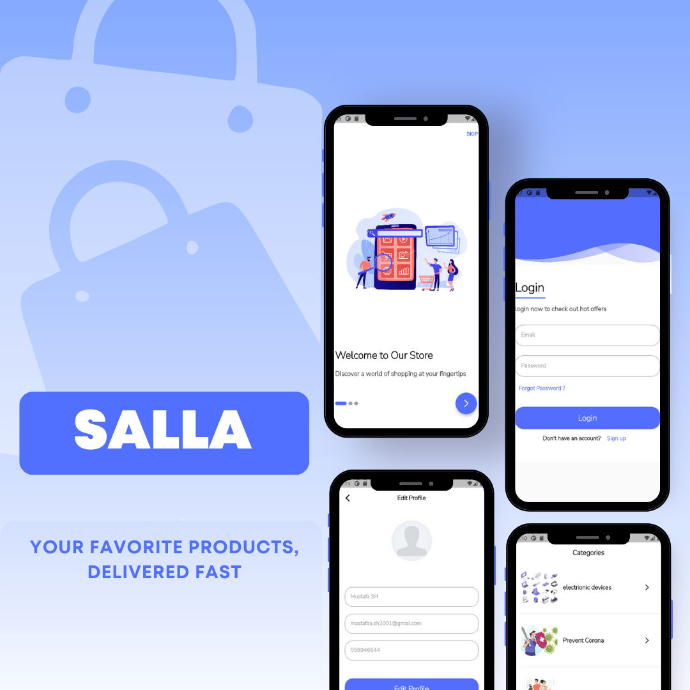

# Salla App

An e-commerce application that allows users to browse products, manage their cart, search for items, and maintain their profile. It leverages a clean, feature-driven architecture with modern state management (GetX) and dependency injection.

---

## Table of Contents

- [Features](#features)
- [Architecture](#architecture)
- [ScreenShots](#screenshot)

---

## Features

- **Onboarding**: A smooth onboarding experience for new users.
- **User Authentication**: Secure login and registration using a remote API.
- **Dynamic Home Screen**: Displays categories and featured products fetched from a remote backend.
- **Advanced Search**: A dedicated search view for finding products by name.
- **Cart Management**: Users can add or remove items from their shopping cart.
- **Category-Based Browsing**: Browse products by specific categories.
- **Favorites**: Mark items as favorites for quick access.
- **User Profile**: Manage user profile and settings, with secure logout.

---

## Architecture

The project follows a modern and scalable feature-first Clean Architecture, promoting a clean separation of concerns.

- **State Management**: **GetX** is used to manage the state of the application. The UI is decoupled from business logic using `GetxController`, making the app reactive and easy to maintain.

- **Dependency Injection**: **GetIt** is used as a service locator to inject dependencies like DataSources, Repositories, and UseCases. API clients (Dio) and Shared Preferences are also injected. This is configured in the `lib/config/dependency_injection.dart` file.

- **Navigation**: **GetX Navigation** is used for route management, providing a simple and efficient way to navigate between screens. Routes are defined in `lib/routes`.

- **Networking**: The **Dio** package, combined with **Retrofit**, is used for making robust and type-safe API calls to the remote server. API constants and configuration are in `lib/core/network`.

- **Local Storage**: **SharedPreferences** is used for storing user sessions (tokens) and application settings.

---

## ScreenShot

